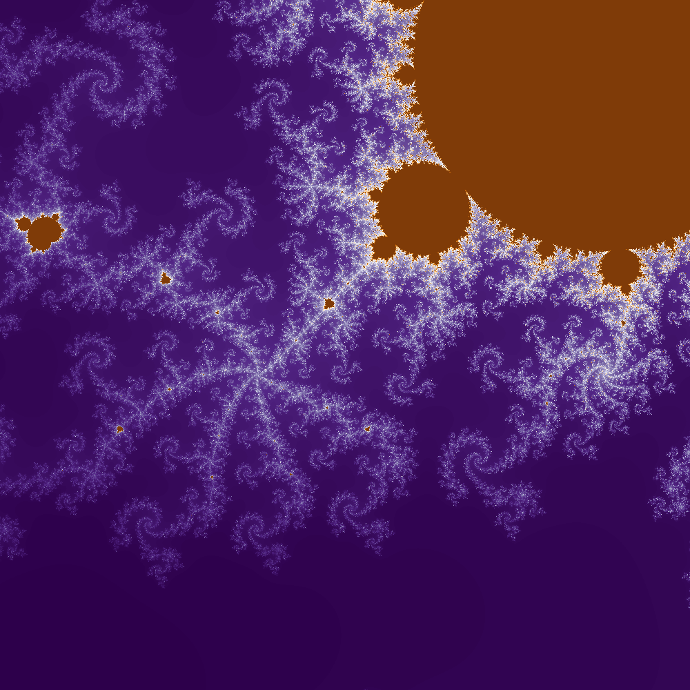
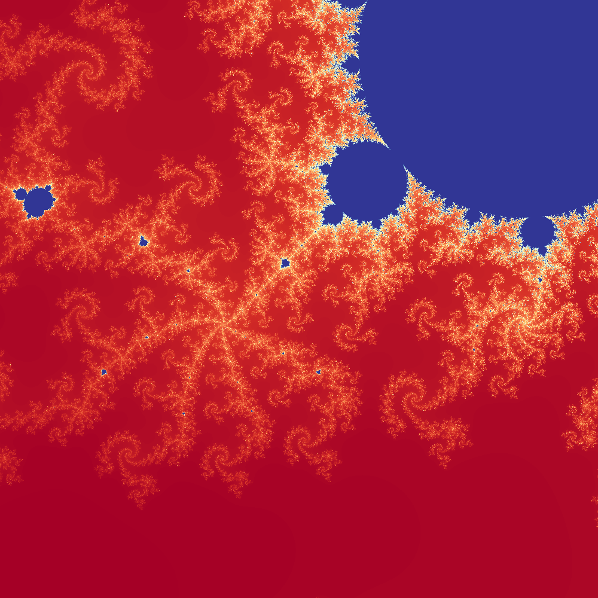
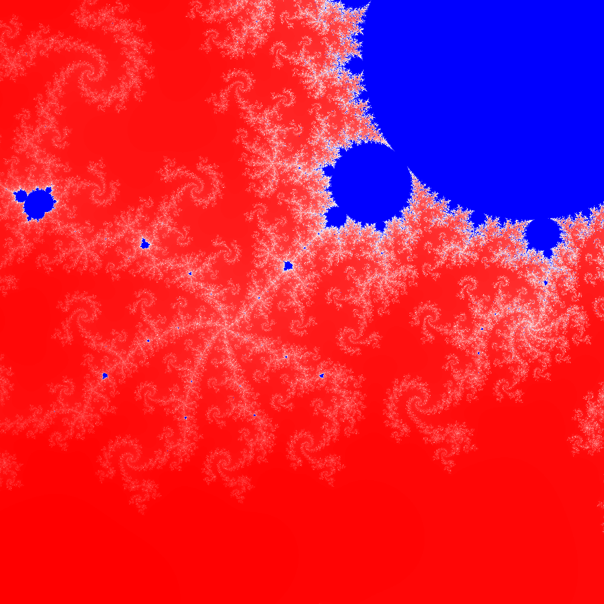
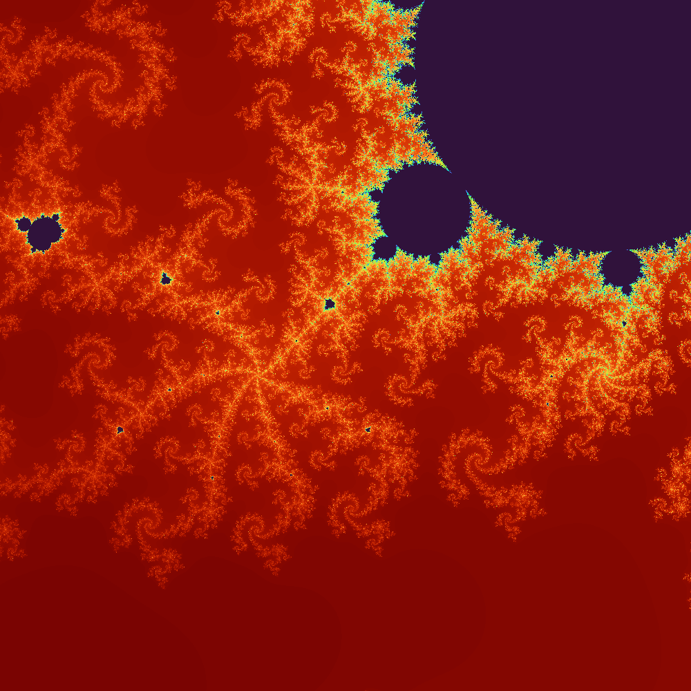

    #Shades of mandelbrot set
    Iterations = 1000 only
    location = {
        Xvals : (-0.22,-0.21)
        Yvals : (-0.70,-0.69)
    }
    Shades : matplotlib colormaps
    Inspiration : https://makeyourownmandelbrot.blogspot.com/

---

